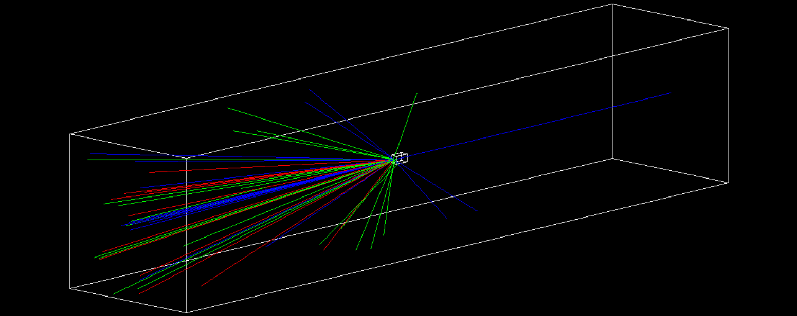
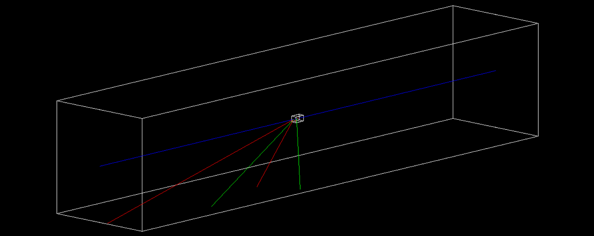

# Proton beam against graphite target
This simple Geant4 project simulates the collision of a 100 GeV proton against a graphite target.

To build the project:
```
mkdir build && cd build
cmake ..
make
./Graphite_Target
```

Examples of the run:


